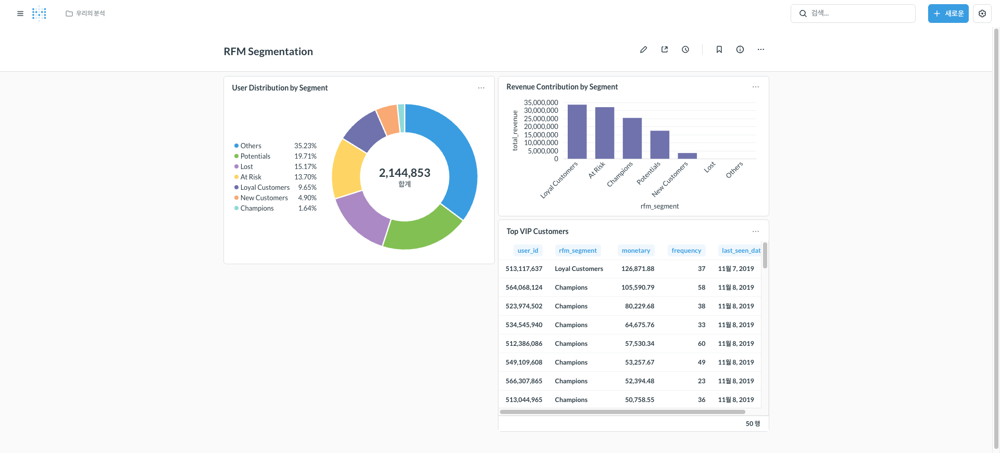
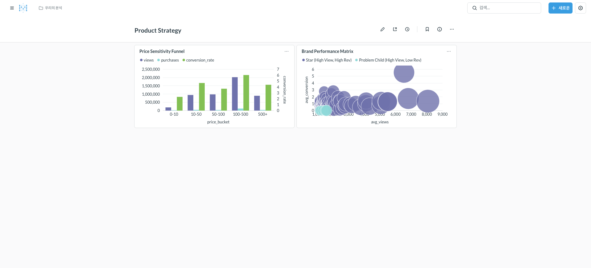
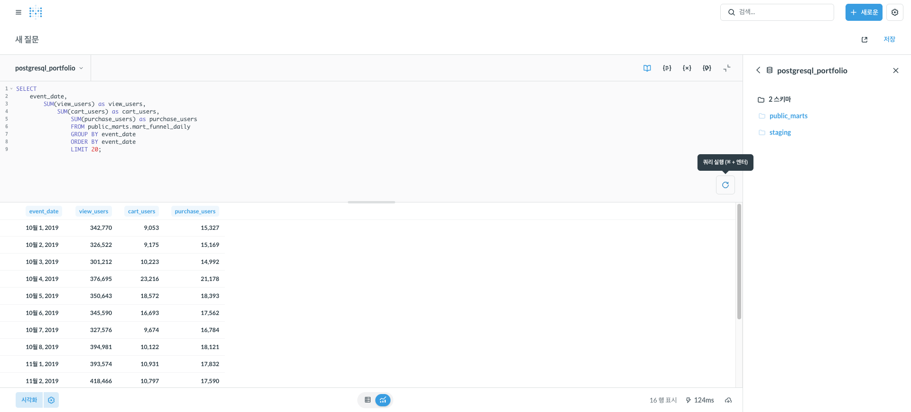
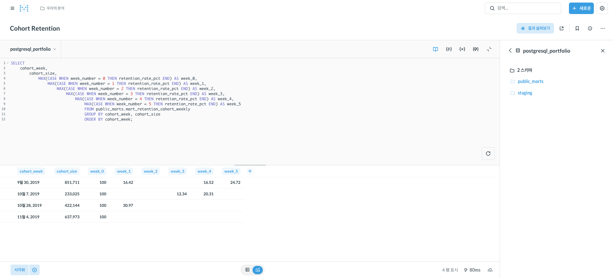
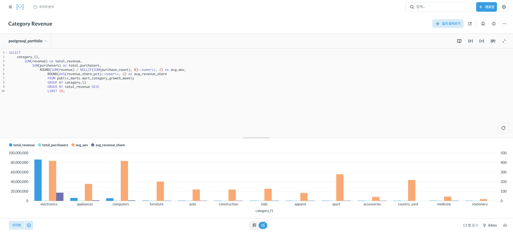

# 🛒 E-commerce Behavior Analytics Platform

**대용량 행동 로그 기반 AARRR 분석 및 고객 세그먼테이션 프로젝트**

> 1억+ 행(14GB) 원본 행동 로그를 정제해 2,360만 이벤트로 퍼널/리텐션/RFM 분석을 수행하고,  
> 비즈니스 의사결정을 위한 BI 대시보드를 구축했습니다.


---

## 📈 핵심 성과 요약

| 구분 | 지표 | 값 |
|------|------|-----|
| **데이터 규모** | 처리 이벤트 | **23.6M+** |
| | 고유 사용자 | 2.14M |
| **비즈니스 지표** | 총 매출 | **$112M** |
| | 구매 전환율 | 5.04% |
| | 평균 주문 금액 (AOV) | $303 |
| **분석 모델** | dbt 마트 | 9개 |
| | 대시보드 | 5개 |

---

## 🎯 분석 목표 & 비즈니스 임팩트

### 해결하고자 한 문제
1. **퍼널 병목 진단**: 어느 단계에서 이탈이 가장 심한가?
2. **고객 세그먼트 전략**: 누구에게 어떤 마케팅을 집중해야 하는가?
3. **가격 전략 최적화**: 가격대별 전환율 차이는 어떠한가?

### 도출된 액션 플랜
| 분석 영역 | 인사이트 | 권장 액션 |
|----------|----------|----------|
| **RFM 세그먼트** | Champions 60%+ 매출 기여 | VIP 얼리액세스, 리워드 강화 |
| **이탈 위험** | At Risk 6.8% 고객 | Win-back 캠페인 (쿠폰/설문) |
| **가격 민감도** | $500+ 구간 전환율 급락 | 할부/보증 옵션 강화 |
| **카테고리** | Electronics 76.9% 집중 | 포트폴리오 다변화 검토 |

---

## 🔬 심화 분석 결과

### 1. RFM 고객 세그먼테이션
고객을 **Recency(최근성)**, **Frequency(빈도)**, **Monetary(금액)** 기준으로 7개 세그먼트로 분류합니다.



**세그먼트 정의:**
- **Champions (5-5-5)**: 최근에 자주, 많이 구매 → 충성도 프로그램
- **Loyal Customers (4-4-4)**: 안정적 고객층 → 업셀링 기회
- **At Risk (R≤2, F≥4)**: 이탈 징후 → Win-back 우선순위
- **New Customers**: 첫 구매 후 활성화 유도 → 온보딩 시퀀스

---

### 2. 가격대별 전환 퍼널 (Price Sensitivity)
가격 구간에 따른 View → Cart → Purchase 전환율을 분석하여 가격 전략을 수립합니다.



**주요 발견:**
- **$0-10**: 높은 전환율(2.1%) → 번들링으로 객단가 상승 유도
- **$100-500**: 전환율 하락 시작점 → 신뢰 요소(리뷰, 보증) 강화
- **$500+**: 급격한 이탈 → 할부, 무료배송, VIP 혜택 제공

---

### 3. 퍼널 & 리텐션 분석

#### Daily Funnel Trend


#### Cohort Retention (Weekly)


**리텐션 패턴:**
- Week 1 평균 **47% 이탈** → 첫 주 리인게이지먼트 중요
- 11월 초 코호트가 상대적 우수 → 시즌 프로모션 효과 추정

---

### 4. 카테고리 & 성장 분석

#### Category Revenue Breakdown


| 카테고리 | 매출 | 점유율 | 전략 |
|----------|------|--------|------|
| electronics | $86.2M | 76.9% | 코어 카테고리 유지 |
| appliances | $6.1M | 5.5% | 교차판매 기회 |
| computers | $5.5M | 4.9% | 고가 세그먼트 집중 |

---

## 🏗 기술 아키텍처

```
┌──────────────┐    ┌──────────────┐    ┌──────────────┐    ┌──────────────┐
│  Raw CSV     │───▶│   DuckDB     │───▶│  PostgreSQL  │───▶│   Metabase   │
│  (14GB+)     │    │  (Parquet)   │    │  + dbt       │    │  Dashboard   │
└──────────────┘    └──────────────┘    └──────────────┘    └──────────────┘
     Kaggle          ETL Pipeline         Data Modeling         BI Layer
```

| 레이어 | 기술 | 역할 |
|--------|------|------|
| **Extract** | DuckDB, PyArrow | 대용량 CSV → Parquet 변환 |
| **Load** | PostgreSQL 15 | 분석용 데이터 웨어하우스 |
| **Transform** | dbt-core 1.7+ | Staging → Fact → Mart 모델링 |
| **Visualize** | Metabase | Self-service BI 대시보드 |
| **Infra** | Docker Compose | 원클릭 재현 환경 |

---

## 📊 dbt 데이터 모델

```
Sources
  └── raw_events (14GB+ CSV)

Staging
  └── stg_events (정제/파싱)

Facts
  ├── fact_events (행동 이벤트)
  └── fact_sessions (세션 통계)

Marts
  ├── mart_funnel_daily          # 일별 퍼널 집계
  ├── mart_retention_cohort      # 코호트 리텐션
  ├── mart_category_growth       # 카테고리 성장
  ├── mart_rfm                   # RFM 세그멘테이션 ⭐
  ├── mart_price_performance     # 가격대 성과 ⭐
  └── mart_product_matrix        # 제품 매트릭스 ⭐
```

---

## 🚀 Quick Start

<details>
<summary><strong>실행 방법 펼치기</strong></summary>

### 1. 환경 설정
```bash
git clone <repo-url>
cd retail-data

python -m venv venv
source venv/bin/activate
pip install -r requirements.txt

cp .env.example .env
```

### 2. 데이터 준비
[Kaggle](https://www.kaggle.com/datasets/mkechinov/ecommerce-behavior-data-from-multi-category-store)에서 다운로드 후 `data/raw/`에 저장:
- `2019-Oct.csv`
- `2019-Nov.csv`

### 3. 인프라 실행
```bash
cd warehouse
docker-compose up -d
```

### 4. 파이프라인 실행
```bash
cd pipelines
python extract_load.py          # CSV → Parquet
python load_postgres.py         # Parquet → PostgreSQL
```

### 5. dbt 모델 실행
```bash
cd dbt
dbt run && dbt test
```

### 6. Metabase 접속
- URL: `http://localhost:3000`
- DB Host: `postgres` / Port: `5432` / DB: `retail_db`

</details>

---

## 📁 프로젝트 구조

```
retail-data/
├── data/raw/                  # Kaggle CSV (gitignore)
├── warehouse/
│   ├── docker-compose.yml     # Postgres + Metabase
│   └── init.sql
├── pipelines/
│   ├── extract_load.py        # ETL: CSV → Parquet
│   └── load_postgres.py       # ETL: Parquet → DB
├── dbt/
│   └── models/
│       ├── staging/
│       └── marts/             # 분석 마트 (9개)
├── docs/
│   ├── kpi_definition.md
│   ├── data_dictionary.md
│   └── screenshots/           # 대시보드 캡처
└── README.md
```

---

## 📚 문서

| 문서 | 설명 |
|------|------|
| [KPI 정의서](docs/kpi_definition.md) | 지표 계산식 및 비즈니스 정의 |
| [데이터 사전](docs/data_dictionary.md) | 테이블/컬럼 명세 |
| [인사이트 요약](docs/insights_summary.md) | 분석 결과 상세 |

---

## 🔮 향후 확장 계획

- [ ] **실시간 처리**: Kafka + Flink 스트리밍 파이프라인
- [ ] **ML 모델**: 이탈 예측, 추천 시스템
- [ ] **전체 데이터**: 2019년 연간 데이터 확장

---

## 📝 라이선스

MIT License

---

## 🙏 Credits

- Data: [REES46 Marketing Platform](https://rees46.com/)
- Dataset: [Kaggle E-commerce Behavior Data](https://www.kaggle.com/datasets/mkechinov/ecommerce-behavior-data-from-multi-category-store)
